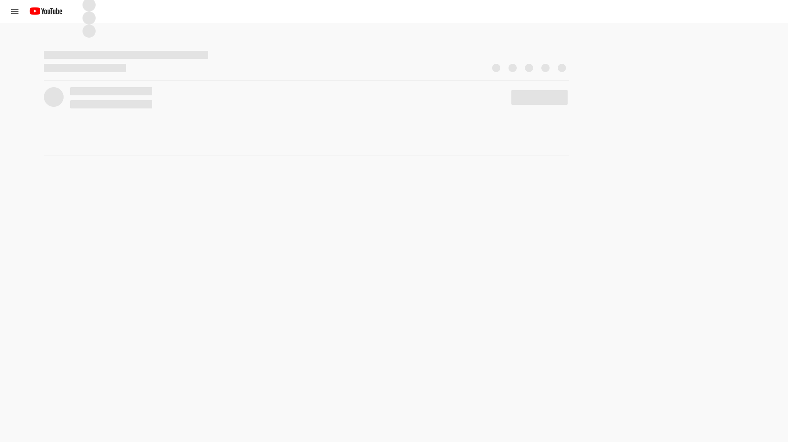

## ✁ - - - - - - - - - - - - - - - - - - - - - - - - - - - - - - - - - - - - - - - - - - - - - - - - - - - - - - - - - -

# This branch

## Description

Fixing: assumed problems with PhantomJS.

## Status

❌Cancelled

## Findings

It turned out that PhantomJS (PJS) doesn't work at all with the current version of Youtube (YT).
The reason it worked before was because YT appeared to serve an old YT page version to PJS¹, probably because it deemed it necessary that this "browser" couldn't handle the new version.
That seemed to stop at some point, and PJS right now is no longer able to load YT:



PJS itself seems to no longer be developed, with [latest release](https://github.com/ariya/phantomjs/releases) being 2.1.1 on Jan 24, 2016.


¹ I observed that a long time ago, when I was tinkering on the project, and made the page be displayed so I can pick some selectors, because they were not the same as in my browser (YT was already a newer version even back then)

## Conclusion

PJS seems unable to serve its purpose anymore.

## ✃ - - - - - - - - - - - - - - - - - - - - - - - - - - - - - - - - - - - - - - - - - - - - - - - - - - - - - - - - - -

# Youtube comment scraper
[](LICENSE)
[](https://badge.fury.io/js/youtube-comment-scraper)
[](https://codeclimate.com/github/itslab-kyushu/youtube-comment-scraper)
[](http://qiita.com/jkawamoto/items/97d88f27c7d13df8dbf5)

Scraping comments from Youtube.

## Installation
To install `youtube-comment-scraper` in your global environment,
```sh
$ npm install -g youtube-comment-scraper
```
after that, you can use `scraper` command.


## Usage
```
Usage: scraper url [options]

        url
                URL for a Youtube video page or video ID.

        --help, -h
                Displays help information about this script

        --version
                Displays version info
```

Output is a JSON format text.
Its schema looks like

```json
{
  "id": "the video ID.",
  "channel":{
    "id": "ID of the channel the video belongs to.",
    "name" : "the channel name."
  },
  "comments": [
    {
      "root": "root (parent) comment body.",
      "author": "author of the root comment.",
      "author_id": "ID of the author",
      "like": "like score (summation of +1 for like and -1 for dislike).",
      "children": [
        {
          "comment": "reply comment.",
          "author": "author of the reply comment.",
          "author_id": "author ID",
          "like": "like score."
        },
        ...
      ]
    },
    ...
  ]
}
```


Method
---------
```js
var scraper = require("youtube-comment-scraper");
```

### `scraper.comments(url)`
Scraping a given Youtube page and return a set of comments.

- Args:
  - url: URL of the target page or video ID.
- Returns:
 Promise object. Use "then" to receive results.

### `scraper.channel(url)`
Scraping a Youtube channel page and return a description of the channel.

- Args:
  - id: channel ID.
- Returns:
  Promise object. Use "then" method to receive results.

### `scraper.close()`
Cleanup this module. After all scrapings have done, this method should be called.
Otherwise, some instances of PhantomJS will keep running and it prevents
finishing main process.

### example
```js
scraper.comments(some_url).then(function(res) {
  // Printing the result.
  console.log(JSON.stringify({
    url: some_url,
    comments: res
  }));

  // Close scraper.
  scraper.close();
});
```

For developers
-----------------

### Build
Run the following two command.

```sh
$ npm install
$ npm run build
```

### Run

```sh
$ ./bin/cli.js <url>
```

`<url>` is a Youtube url.

License
--------
This software is released under the MIT License, see [LICENSE](LICENSE).
